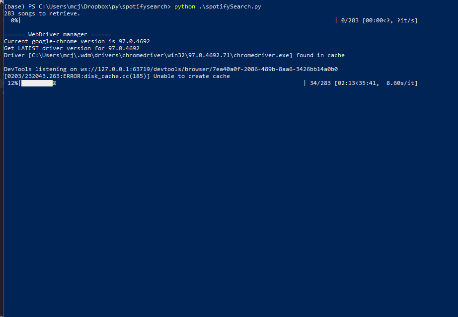
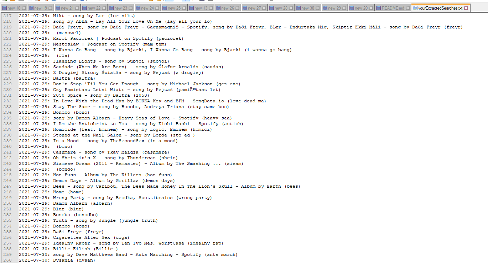

# My Spotify Data - Search History Song Names Retrieval
> Song names retrieval from personal JSON data files obtained from Spotify.

## Table of contents
* [General info](#general-info)
* [Screenshots](#screenshots)
* [Technologies](#technologies)
* [Setup](#setup)
* [Features](#features)
* [Status](#status)
* [Inspiration](#inspiration)
* [Contact](#contact)

## General info
Does anybody else listen to music on Spotify by storing them in a play queue which is getting sometimes very, very long? You probably experienced losing all these songs for reasons unknown at least once, I know I did - and multiple times. There is no backup to that and the only way to recreate it, or at least know what was there, is to ask Spotify for your data. They collect your search queries and can send them to you and it takes them about 5 days to do so. Once you got them, you can run this app and get clear txt file that retrieves all names of songs, artists, podcastss and whatever else you clicked in your Spotify searchbar in given time.

The project uses Selenium to get URL target names from non-readable links by searching them in Google and returning results one by one.

## Screenshots

## Technologies
* Python 3.7

## Setup
This project uses following packages:
* json
* os
* shutil
* selenium
* tqdm
* webdriver_manager.chrome

Other requirements include installed Google Chrome and, of course, Python (3.7 or higher) environement along with all required packages.
Place your obtained searchQueries.json file in the folder. You can use setupFile.py to change input and output filenames.

## Features
* Progress bar and elapsed/remaining time
* Seperate setup txt file
* Working in the background (headless mode)
* Protection against Google bot detectors
* Once set up, fully automatic
* Results presented in a clear, txt way with date, result and original search

To-do list:
* Speed improvements
* Code quality and readability

## Status
Project is: _in progress_

## Inspiration
Project inspired by Spotify, which did not and most probably will not introduce queue backup options. Thank you, Spotify.

## Contact
Created purely by Maciej Konieczny for my needs and whole world needs.# spotifyPlayQueueRetriever
